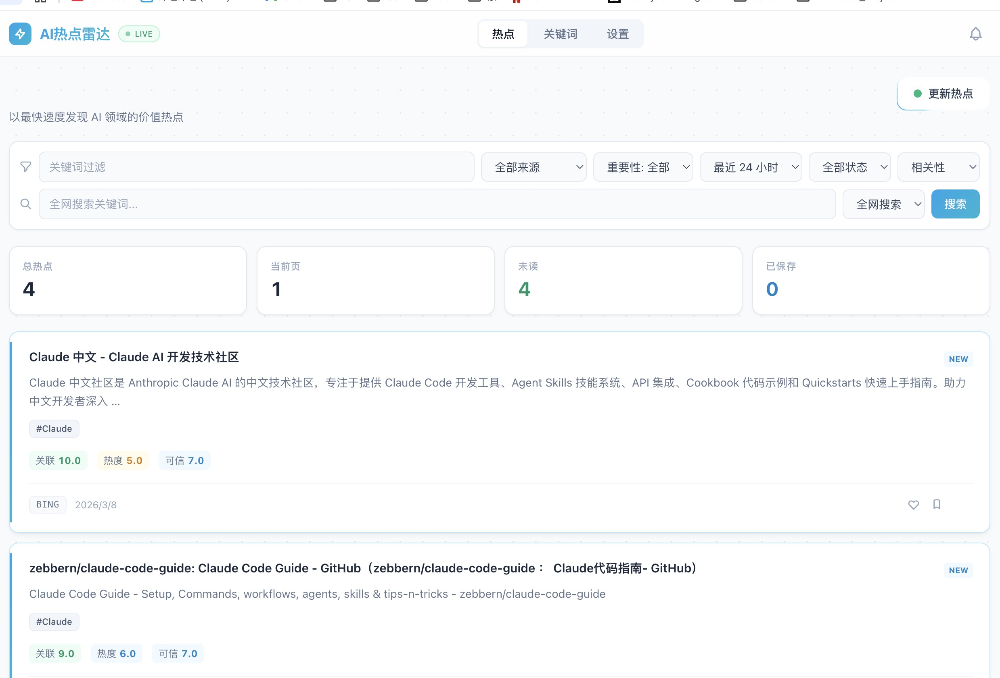
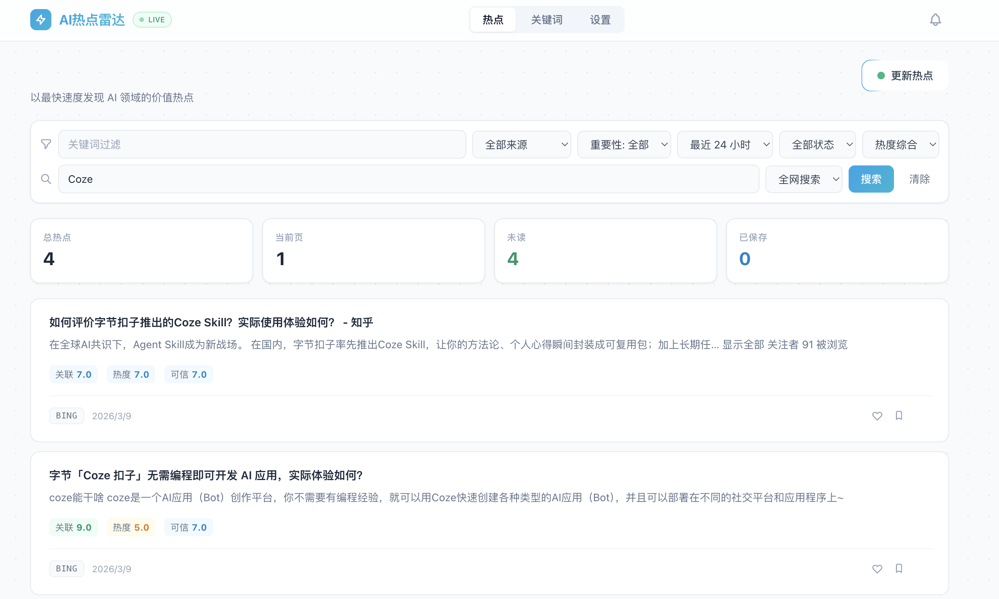
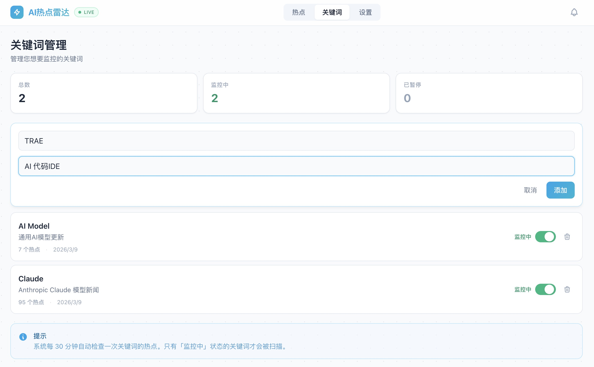
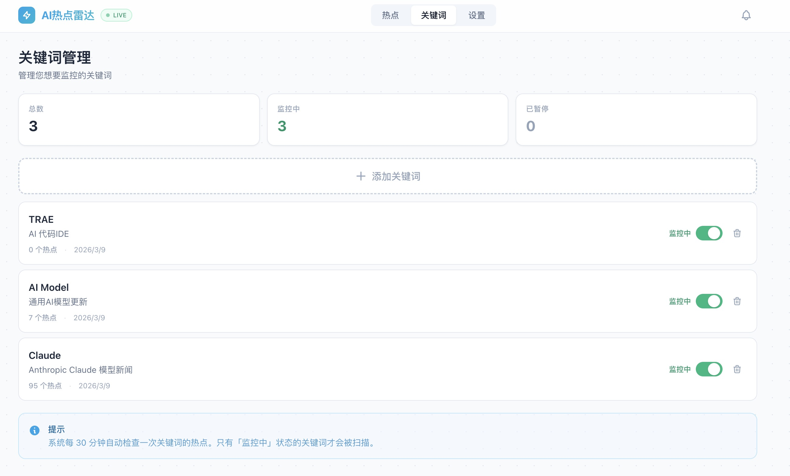
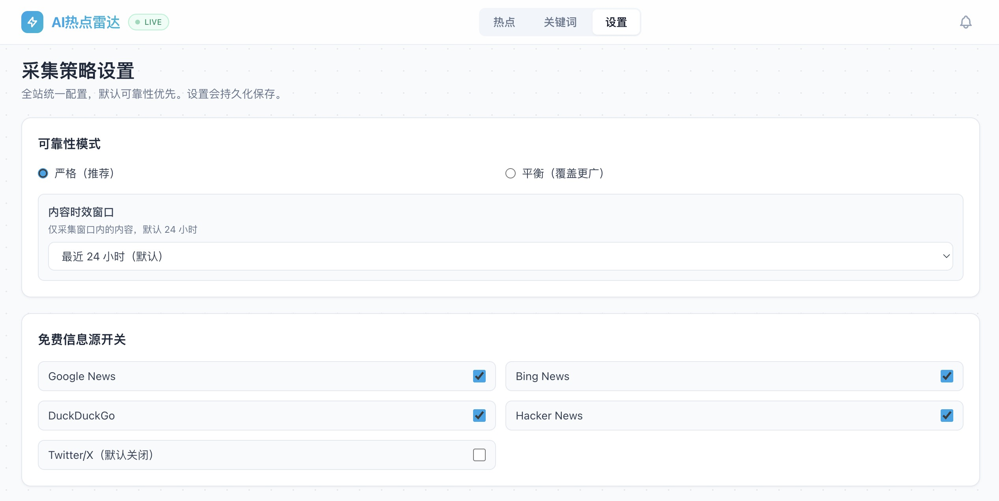
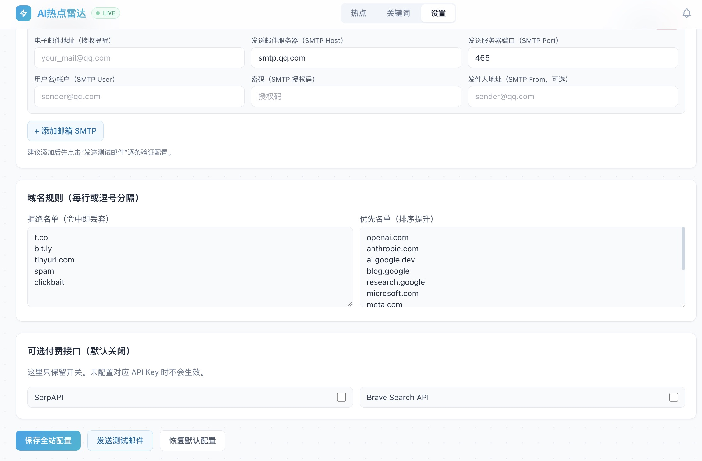

# 产品界面展示

本页用于在 GitHub 直接展示 AI Hot Spot 的核心页面效果。建议所有对外展示截图统一放在 `docs/screenshots/` 目录，避免 README 或文档中的图片链接失效。

## 项目展示概览

这组截图已经覆盖了项目的核心使用链路：

1. 热点总览与搜索
2. 关键词管理与新增
3. 采集策略配置
4. 邮件推送与规则设置

对应文件：

- `docs/screenshots/hotspot_mainpage.jpg`
- `docs/screenshots/search_function.jpg`
- `docs/screenshots/keywords.jpg`
- `docs/screenshots/keywords_afteradd.jpg`
- `docs/screenshots/settings.jpg`
- `docs/screenshots/settings2.jpg`

## 建议展示顺序

### 1. 热点总览



这个页面最适合放在 GitHub 首页作为主视觉，能够直接体现产品的核心价值：

- 顶部导航
- 热点卡片列表
- 排序与筛选控件
- 热度/相关度/可信度标签

它展示了系统如何把抓取到的内容转化为结构化热点列表，并支持按来源、时间、状态、重要性进行筛选。

### 2. 搜索与检索体验



这一页突出的是“监控 + 搜索”双模式能力：

- 支持直接输入关键词进行检索
- 支持全网搜索与本地搜索切换
- 搜索结果仍然保留三维评分与卡片化展示
- 适合向 GitHub 访问者说明产品不仅能被动监控，也支持主动探索

### 2. 关键词管理



该页面用于展示关键词配置能力：

- 关键词列表
- 激活/暂停状态
- 新增关键词交互区

这是系统的入口配置页面，适合说明用户如何定义自己的监控主题。

### 4. 新增关键词后的状态



这张图很好地补充了“操作前后”的变化：

- 新增关键词后总数从 2 变为 3
- 监控中的关键词数量同步变化
- 新增项直接进入列表并可被系统定时扫描

这类截图很适合在 README 或作品集里体现产品是“可操作、可验证”的，而不是静态原型。

### 3. 采集策略设置



该页展示后台策略控制能力：

- 严格 / 平衡 模式切换
- 内容时效窗口
- 免费信息源启用状态
- Twitter/X 高门槛过滤条件

这张图非常适合体现你对“数据质量”和“信噪比控制”的产品思考。

### 4. 邮件推送设置



这个页面补齐了策略设置的下半部分，体现了系统的可运营性：

- 域名拒绝名单与优先名单
- 可选付费接口开关
- 保存全站配置、发送测试邮件、恢复默认配置

如果你后续还想单独展示邮件推送表单，可以再补一张专门聚焦 SMTP 配置区的截图。

## 推荐对外叙事方式

如果你要在 GitHub、作品集或简历附件里展示这个项目，建议这样讲：

1. 用热点总览页说明产品解决的是“信息过载下的热点发现”问题。
2. 用搜索页说明产品不仅支持监控，也支持主动探索和临时检索。
3. 用关键词管理页说明用户如何定义自己的监控范围。
4. 用设置页说明系统具备策略配置、源质量控制和通知能力。

## 截图操作建议

### 本地启动

```bash
# 终端 1
cd backend
npm run dev

# 终端 2
cd frontend
npm run dev
```

前端默认地址：`http://127.0.0.1:3000/`

### 截图规范

建议统一使用以下规范：

- 桌面端宽度：1440px 左右
- 移动端宽度：390px 左右
- 优先截图完整页面首屏，不要截浏览器无关内容
- 尽量保留真实数据，避免全部是空状态
- 同一批截图保持同一缩放比例和浏览器主题

### macOS 快速截图

- 区域截图：`Shift + Command + 4`
- 窗口截图：`Shift + Command + 4`，再按空格
- 建议保存后压缩图片体积，再放入 `docs/screenshots/`

## GitHub 展示建议

如果你希望访问仓库首页的人第一眼就看到效果，建议这样做：

1. 在 `README.md` 顶部保留一张主视觉截图，优先使用热点总览页。
2. 在 `README.md` 中放一个“查看更多界面”链接，跳转到本页。
3. 本页按“总览 -> 管理 -> 策略 -> 通知 -> 规则”的顺序展示，形成完整产品叙事。
4. 截图文件名保持稳定，后续只替换图片内容，不改文件名。

## 可选增强

如果你后续想让展示更完整，可以继续补充：

- 一张系统架构图
- 一段 10 到 20 秒的 GIF 演示
- 一张“关键词新增 -> 热点刷新 -> 通知触达”的流程图